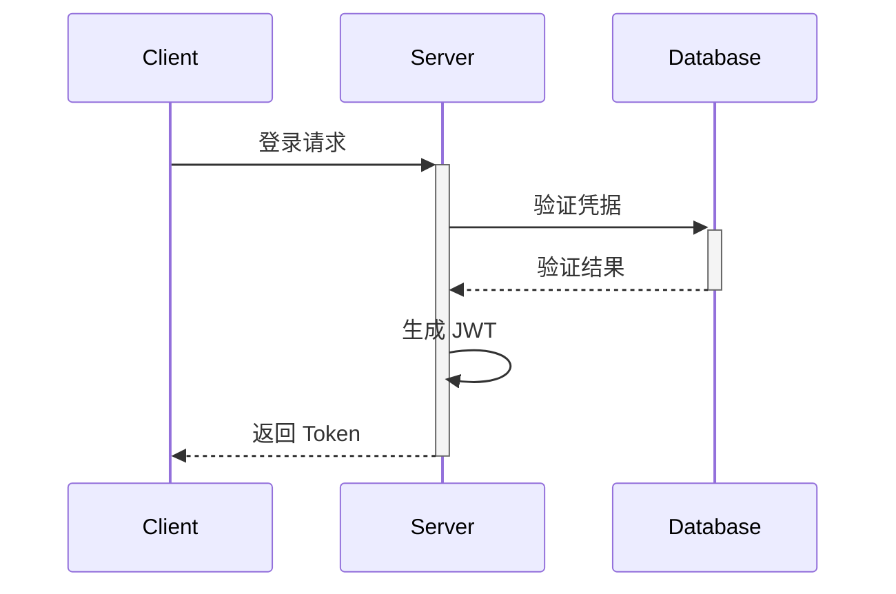

# DB-Modeler 技术架构文档

## 1. 前端架构

### 1.1 目录结构

```
frontend/
├── src/
│   ├── api/          # API 接口封装
│   ├── components/   # 可复用组件
│   ├── pages/        # 页面组件
│   ├── store/        # 状态管理
│   ├── utils/        # 工具函数
│   ├── styles/       # 样式文件
│   ├── router/       # 路由配置
│   └── types/        # TypeScript 类型定义
```

### 1.2 核心模块说明

#### 1.2.1 状态管理 (Recoil)

- 用户状态
- 项目状态
- 数据库连接状态
- UI 状态

#### 1.2.2 路由系统

- 权限路由
- 动态路由
- 路由守卫

#### 1.2.3 组件系统

- 基础组件
- 业务组件
- 布局组件

### 1.3 构建和部署

- Vite 构建配置
- 环境变量管理
- 静态资源处理

## 2. 后端架构

### 2.1 目录结构

```
src/
├── config/         # 配置文件
├── controllers/    # 控制器
├── models/         # 数据模型
├── routes/         # 路由定义
├── middleware/     # 中间件
├── services/       # 业务服务
└── utils/          # 工具函数
```

### 2.2 核心模块说明

#### 2.2.1 数据库访问层

- Sequelize ORM
- 数据库连接池
- 事务管理

#### 2.2.2 认证和授权

- JWT 认证
- 权限中间件
- 会话管理

#### 2.2.3 业务服务层

- 用户服务
- 项目服务
- 数据库服务
- 团队服务

### 2.3 中间件

- 错误处理
- 日志记录
- 请求验证
- 响应格式化

## 3. 数据库架构

### 3.1 主要数据模型

```sql
-- 用户表
CREATE TABLE users (
    id VARCHAR(36) PRIMARY KEY,
    username VARCHAR(50) UNIQUE NOT NULL,
    email VARCHAR(255) UNIQUE NOT NULL,
    password_hash VARCHAR(255) NOT NULL,
    created_at TIMESTAMP DEFAULT CURRENT_TIMESTAMP,
    updated_at TIMESTAMP DEFAULT CURRENT_TIMESTAMP
);

-- 项目表
CREATE TABLE projects (
    id VARCHAR(36) PRIMARY KEY,
    name VARCHAR(100) NOT NULL,
    description TEXT,
    owner_id VARCHAR(36) REFERENCES users(id),
    created_at TIMESTAMP DEFAULT CURRENT_TIMESTAMP,
    updated_at TIMESTAMP DEFAULT CURRENT_TIMESTAMP
);

-- 数据库连接表
CREATE TABLE database_connections (
    id VARCHAR(36) PRIMARY KEY,
    project_id VARCHAR(36) REFERENCES projects(id),
    name VARCHAR(100) NOT NULL,
    type VARCHAR(50) NOT NULL,
    host VARCHAR(255),
    port INTEGER,
    username VARCHAR(100),
    password_encrypted TEXT,
    database_name VARCHAR(100),
    created_at TIMESTAMP DEFAULT CURRENT_TIMESTAMP,
    updated_at TIMESTAMP DEFAULT CURRENT_TIMESTAMP
);
```

### 3.2 索引策略

- 主键索引
- 外键索引
- 复合索引
- 全文索引

## 4. API 架构

### 4.1 RESTful API

#### 认证 API
```
POST   /api/auth/login
POST   /api/auth/register
POST   /api/auth/refresh-token
POST   /api/auth/logout
```

#### 项目 API
```
GET    /api/projects
POST   /api/projects
GET    /api/projects/:id
PUT    /api/projects/:id
DELETE /api/projects/:id
```

#### 数据库 API
```
GET    /api/databases
POST   /api/databases
GET    /api/databases/:id
PUT    /api/databases/:id
DELETE /api/databases/:id
```

### 4.2 WebSocket API

```javascript
// 事件类型
const EVENT_TYPES = {
    MODEL_UPDATED: 'model:updated',
    COLLABORATION_CHANGE: 'collaboration:change',
    USER_PRESENCE: 'user:presence'
};
```

## 5. 安全架构

### 5.1 认证流程



### 5.2 数据加密

- 传输层加密 (TLS)
- 数据库密码加密
- 敏感信息加密

## 6. 部署架构

### 6.1 开发环境

- 本地开发服务器
- 开发数据库
- Redis 开发实例

### 6.2 生产环境

- 负载均衡
- 应用服务器集群
- 数据库主从架构
- Redis 集群

### 6.3 监控系统

- 性能监控
- 错误监控
- 业务监控

## 7. 测试架构

### 7.1 单元测试

- Jest 配置
- 测试用例组织
- Mock 策略

### 7.2 集成测试

- API 测试
- 数据库测试
- 端到端测试

## 8. 持续集成/持续部署

### 8.1 CI 流程

- 代码检查
- 单元测试
- 构建测试

### 8.2 CD 流程

- 自动部署
- 环境配置
- 回滚策略
